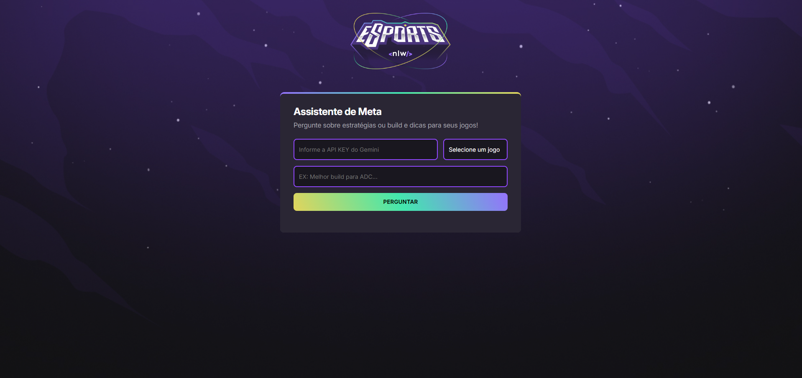

## Assistente de Meta

Uma aplicação web que utiliza a API do **Gemini** (Google AI) para responder perguntas sobre estratégias, builds e dicas dos jogos **Valorant**, **League of Legends** e **CS:GO**. Tudo isso com uma interface moderna e responsiva!

---

## Tecnologias Utilizadas

- HTML5  
- CSS3  
- JavaScript (Vanilla)  
- [Google Gemini API](https://ai.google.dev/)  
- [Showdown.js](https://github.com/showdownjs/showdown) (para converter Markdown em HTML)

---

## Funcionalidades

- Permite ao usuário perguntar dicas e estratégias sobre um jogo selecionado.
- Retorna a resposta da IA com base no patch atual do jogo.
- Formatação de resposta em Markdown (exibida como HTML).
- Animações e feedbacks visuais durante a requisição.
- Respostas diretas, sem enrolação — foco no meta!

---

## Preview



---

## Como Executar

1. **Clone o repositório:**

```bash
git clone https://github.com/YlkersonDias/BOT-DO-META.git
```

2. **Abra o arquivo `index.html` no seu navegador.**

---

## Requisitos

- Navegador moderno (recomendado: Chrome, Edge ou Firefox)
- Conexão com a internet
- Uma chave da API Gemini válida:
  - Crie em: https://ai.google.dev/
  - Ative o modelo `gemini-2.5-flash`

---

## Estrutura de Pastas

```
/
├── index.html
├── style.css
├── script.js
├── assets/
│   ├── logo.png
│   ├── bg.jpg
│   └── Preview.png
```

---

## Licença

Este projeto é de uso **educacional e pessoal**. Fique à vontade para utilizar, modificar e adaptar conforme suas necessidades. Não é permitida a revenda direta deste código sem permissão.

---
